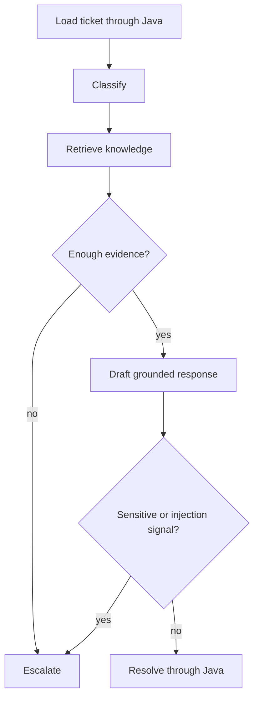

# Agent Runtime

The agent runtime is a bounded, single LangGraph workflow, not a general
multi-agent system. `AgentRunState` is a Pydantic model used to validate run
creation and terminal streaming state; LangGraph receives its dictionary form
so node updates remain explicit and compatible. Its fixed transition path is classification, knowledge
search, confidence check, response generation, sensitivity check, then either
resolution or escalation.

Model calls have a configured timeout and a single retry. The deterministic
fallback preserves testability when no provider key is present. Tool calls use
timeouts and return through Java. Read-only tools have one bounded backoff retry
for transport/5xx failure; write tools are not retried in Python and use
Java-owned idempotency or approval. The
runtime emits Pydantic-validated `v1` analysis and workflow-event payloads;
Spring validates analysis/event version and ticket identity before returning,
forwarding, or storing them.

Java records a durable summary of each streamed run and raw workflow events.
The blocking analysis endpoint also creates a run and marks it failed when the
Python request fails, preventing abandoned `RUNNING` records.
An agent run can be cancelled by an authorized operator. Cancellation closes the
Java stream and causes Java to reject subsequent tool writes carrying that run
ID. It is cooperative: a model call already in flight is not forcibly killed.
High-confidence resolutions are proposed as a `TICKET_RESOLUTION` approval;
only an agent-role operator can approve the Java-owned, idempotent resolution
transaction. Rejection or cancellation prevents the proposal from writing.
After each node, the runtime validates and atomically persists its bounded
Pydantic state plus the next deterministic node. Checkpoints contain no new
business authority: Java remains authoritative for run status, approvals, and
writes. `SMARTHELP_CHECKPOINT_DIR` must point to a persistent mounted volume in
deployed environments. A reconnect can use the same Java run ID on the
workflow stream; it resumes only `RUNNING` or interrupted `FAILED` runs, never
completed, cancelled, or approval-waiting runs. Terminal write retries are
safe because escalation uses a run-scoped idempotency key and approvals are
created idempotently by Java. Persisted Java events support an `afterEventId`
cursor for client reconnects.

Each streamed `v1` workflow event also carries the Java-created run ID. The
workflow screen uses it to make at most three exponential-backoff reconnect
attempts to that same run; it never creates a second run after a disconnection.
An approval-waiting `RESOLVE` completion is forwarded before the stream closes,
so that normal human handoff is not mistaken for a transport failure.
