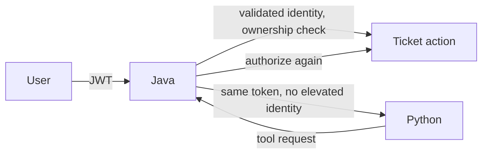

# Security Architecture

In production OIDC mode, Spring Security validates JWTs against the configured
issuer. `CurrentUserAccess` maps the verified `email` claim to a local database
user and enforces customer ticket ownership plus agent-only operations. Python
forwards the caller token but never validates roles or makes authorization
decisions itself.

Ticket content, retrieved articles, tool output, and LLM output are untrusted
data. Prompt policy and deterministic sensitivity checks escalate known prompt
injection signals; they are defense in depth, not an authorization control.
Java validates every state change, records audit events, and applies idempotency
to agent writes.

Python exposes only tools in its typed registry. Each declaration has a risk
level, Java permission name, timeout, idempotency mode, and approval requirement.
The registry rejects a high-risk tool if it is pointed at a non-approval endpoint;
Java remains the authority that enforces the permission and executes the write.

In production, the Python runtime also requires an internal shared token on
workflow entry points. Spring adds that token from deployment configuration;
the runtime compares it in constant time and fails startup when token-required
mode has no configured secret. This prevents direct public invocation of agent
work while retaining an explicit local-open development mode.

The local security profile is for development only. Tenant isolation, browser
sign-in, CSRF/session decisions, retention/redaction of run payloads, and a
full OpenTelemetry data-sensitivity policy are open work. Detailed threats and
mitigations live in `docs/threat-model/README.md`.

When OIDC mode is enabled, CORS accepts only the configured frontend origin and
explicit preview-origin allowlist. Localhost development origins are available
only in the local-open profile.

The production SPA container adds MIME-sniffing, framing, referrer, and unused
browser-permission protections. It serves missing hashed assets as 404 rather
than silently returning the SPA entry point; a CSP remains deployment-specific
until the final frontend/API origins are selected.
