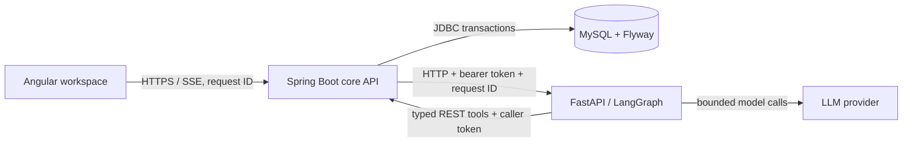

# SmartHelp System Architecture

SmartHelp is a three-process application: an Angular workspace, a Spring Boot
core API, and a Python LangGraph runtime. The existing layout is retained
deliberately while contracts and operational controls mature.

Spring Boot is the system of record for users, tickets, responses, authorization,
idempotency, audit records, and run history. Python may retrieve evidence and
propose a resolution or escalation, but it does not connect to the database or
authorize itself. The browser never supplies an authoritative role or identity.

## Request lifecycle

1. The browser calls `/api/v1`; `RequestIdFilter` validates or creates an
   `X-Request-ID` value.
2. In OIDC mode, Spring validates the JWT and maps its `email` claim to a local
   user role before resource access is checked.
3. For a workflow, Spring creates an `agent_runs` ledger row with the request
   correlation ID and streams Python workflow events to the browser while
   persisting the event payloads. The run explorer exposes both identifiers so
   an operator can join browser, API, and workflow evidence during an incident.
4. Python calls Java tools with the original bearer token and request ID.
5. A Java-owned transactional action validates role and idempotency, changes the
   ticket, and appends an audit event.

## Operational boundaries

The compatibility `/api` routes remain temporarily alongside `/api/v1`. The
local development security chain is intentionally open; deployment must enable
OIDC and provide a real issuer. See the threat model for open risks.

## Metrics

Actuator exposes Micrometer metrics with the low-cardinality `application=smarthelp`
tag. Agent lifecycle counters (`smarthelp.agent.runs.started` and
`smarthelp.agent.runs.finished`), run duration, and approval requested/decision
counters are measured at the Java-owned state transition. They are available
through the protected operational metrics endpoint; no benchmark claims are
made without a reproducible load run.

Java console logs include the MDC request ID emitted by RequestIdFilter; agent
runs retain the same ID in the database. The application does not yet claim
JSON logs or OpenTelemetry tracing.

## Error contract

API failures use `application/problem+json` and include RFC 9457-compatible
`type`, `title`, `detail`, `status`, and `instance` fields. The older `error`,
`message`, `path`, request ID, and timestamp extensions remain during the
compatibility period so existing clients can migrate safely.
